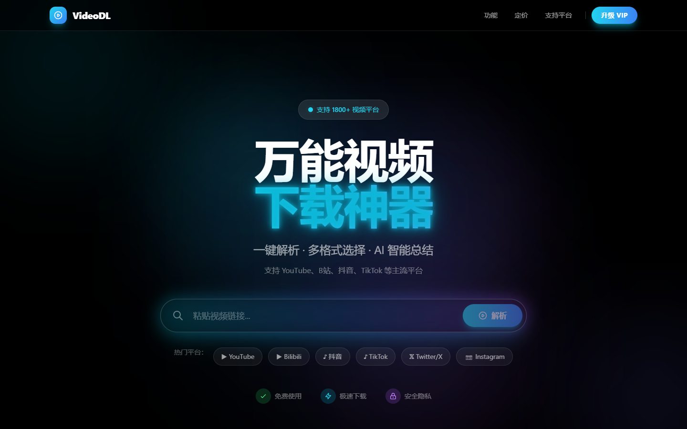
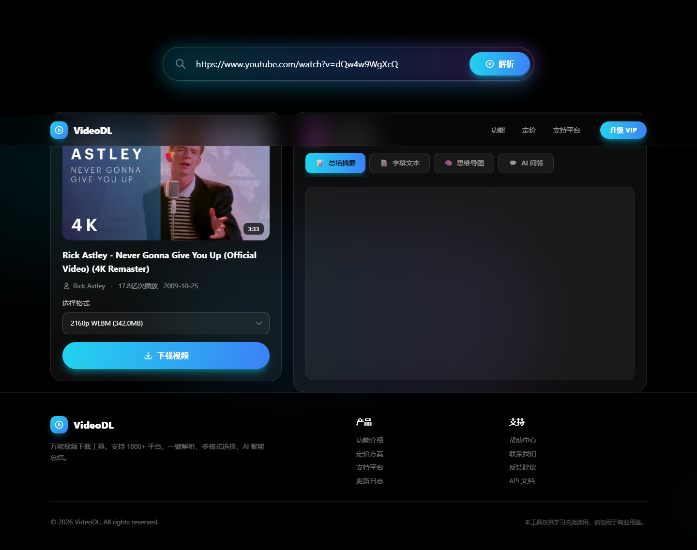

# VideoDL - 万能视频下载网站

> 一个跨平台的万能视频下载工具，支持 1800+ 平台视频解析下载 + AI 视频总结




## 项目简介

输入一个视频链接，自动解析视频信息，支持从 YouTube、B站、抖音等 **1800+** 平台下载视频，同时提供 **AI 视频总结**（摘要 + 思维导图 + 问答），一个链接搞定视频下载 + AI 总结！




## 核心功能

### 1. 多平台视频解析和下载

基于 yt-dlp 支持 1800+ 网站，涵盖 YouTube、B站、抖音等主流平台，提供多种清晰度和格式供用户选择。支持服务端代理下载，解决 Referer 防盗链问题。

### 2. AI 视频总结摘要

自动提取字幕并调用 DeepSeek 大模型进行内容分析，流式输出结构化总结（概述 + 大纲 + 要点 + 一句话总结），Markdown 格式排版精美。

### 3. AI 生成思维导图

基于视频内容自动生成交互式思维导图，支持全屏展示、缩放拖拽、导出 PNG 和 SVG 格式图片。

### 4. AI 视频问答

基于视频字幕内容进行自由问答，支持多轮对话，AI 给出针对性的回答。

### 5. 字幕导出

支持下载 SRT、VTT、TXT 等多种格式的字幕文件，带时间戳，方便学习和整理。


## 技术栈

| 层次 | 技术 |
|------|------|
| 前端 | Vue 3 (Composition API + `<script setup>`) + Vite |
| 样式 | Tailwind CSS + @tailwindcss/typography |
| 后端 | FastAPI + uvicorn |
| 视频解析 | yt-dlp |
| AI | DeepSeek (openai SDK) |
| Markdown | marked |
| 思维导图 | markmap-lib + markmap-view |


## 项目结构

```
Video_download/
├── backend/
│   ├── main.py            # FastAPI 入口 + CORS + 路由注册
│   ├── downloader.py      # yt-dlp 封装（解析/下载/直链）
│   ├── douyin.py          # 抖音短链重定向处理
│   ├── summarizer.py      # 字幕提取 + DeepSeek AI 调用
│   ├── api_video.py       # 视频 API 路由
│   ├── api_summarize.py   # AI 总结/问答 SSE 路由
│   └── requirements.txt
├── frontend/
│   ├── src/
│   │   ├── App.vue                # 根组件
│   │   ├── components/
│   │   │   ├── HeroSection.vue    # 首屏搜索框
│   │   │   ├── VideoResult.vue    # 结果双栏容器
│   │   │   ├── VideoInfo.vue      # 视频信息 + 下载
│   │   │   ├── VideoSummary.vue   # AI 总结 Tab 面板
│   │   │   ├── SummaryTab.vue     # 总结摘要（SSE 流式）
│   │   │   ├── SubtitleTab.vue    # 字幕列表 + 下载
│   │   │   ├── MindmapTab.vue     # 思维导图 + 导出
│   │   │   └── ChatTab.vue        # AI 问答（多轮对话）
│   │   └── api/                   # API 封装层
│   └── package.json
├── docs/
├── CLAUDE.md
└── todo.md
```


## 快速运行

### 前置条件

- Python >= 3.10
- Node.js >= 18
- DeepSeek API Key（用于 AI 总结）

### 1. 克隆项目

```bash
git clone https://github.com/moyi9/Video_download.git
cd Video_download
```

### 2. 启动后端

```bash
cd backend
pip install -r requirements.txt
cp .env.example .env
# 编辑 .env 填入 DEEPSEEK_API_KEY
uvicorn main:app --host 0.0.0.0 --port 8000
```

### 3. 启动前端

```bash
cd frontend
npm install
npm run dev
```

### 4. 访问使用

浏览器打开 http://localhost:5173，输入视频链接即可体验。


## API 接口

| 接口 | 方法 | 说明 |
|------|------|------|
| `/api/parse` | POST | 解析视频信息 |
| `/api/direct-url` | POST | 获取视频直链 |
| `/api/download` | POST | 代理下载视频 |
| `/api/thumbnail` | GET | 图片代理（绕过防盗链） |
| `/api/summarize` | POST | AI 总结（SSE 流式） |
| `/api/chat` | POST | AI 问答（SSE 流式） |


## 支持平台

YouTube、B站、抖音、TikTok、Twitter/X、Instagram、Vimeo、Twitch、Facebook 等 1800+ 平台。


## 合规声明

本项目仅供技术学习和研究目的，请用户仅下载自己拥有版权或已获得合法授权的内容。用户应自行遵守所在地区的法律法规及各平台的服务条款。
